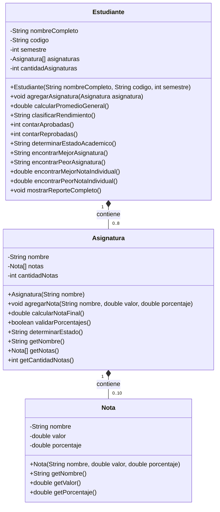
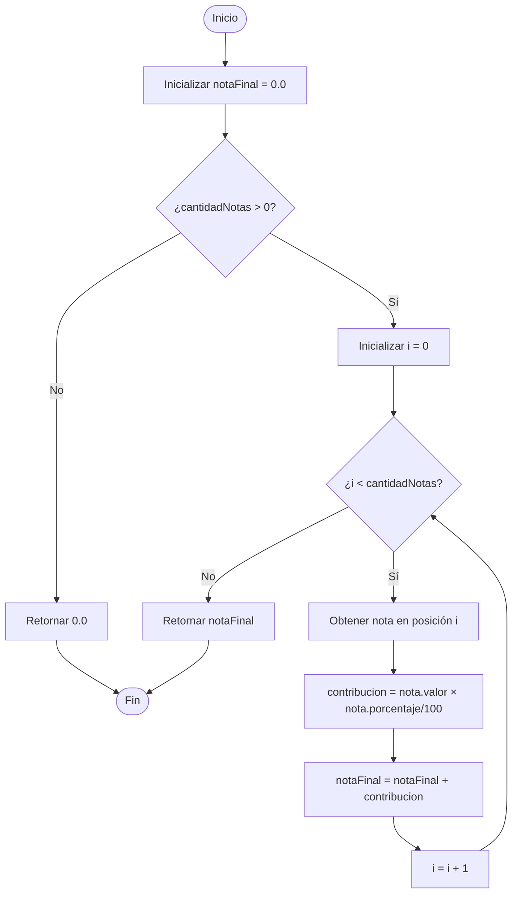
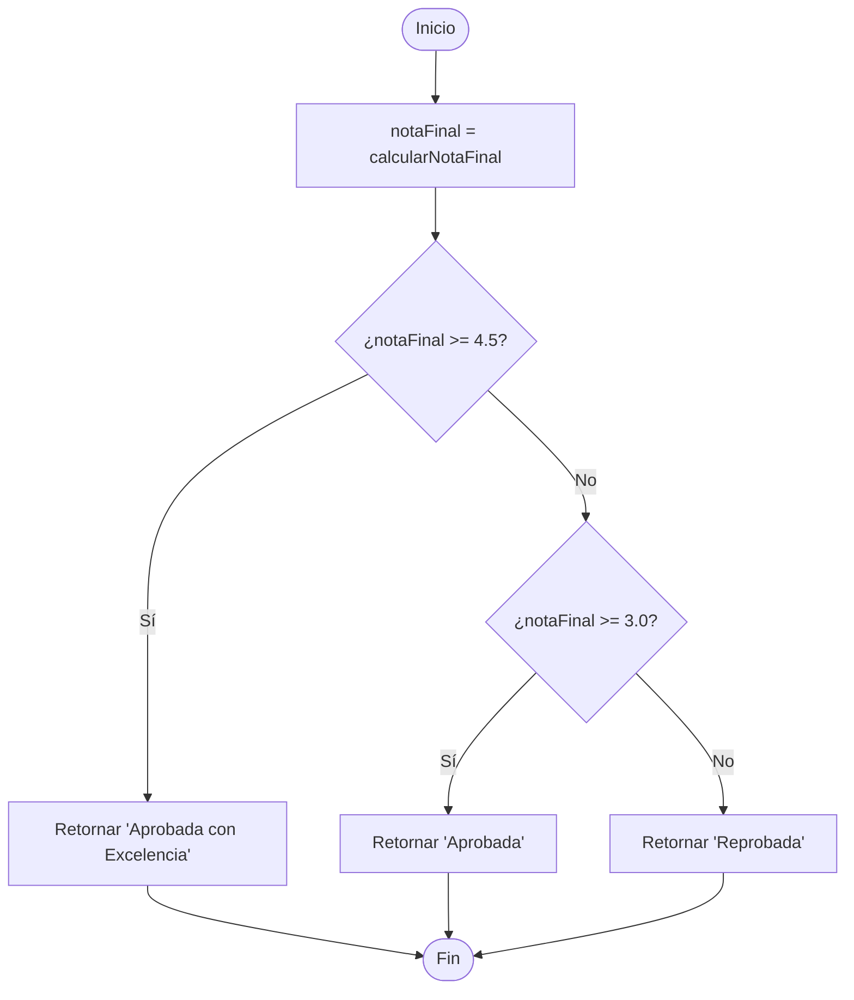
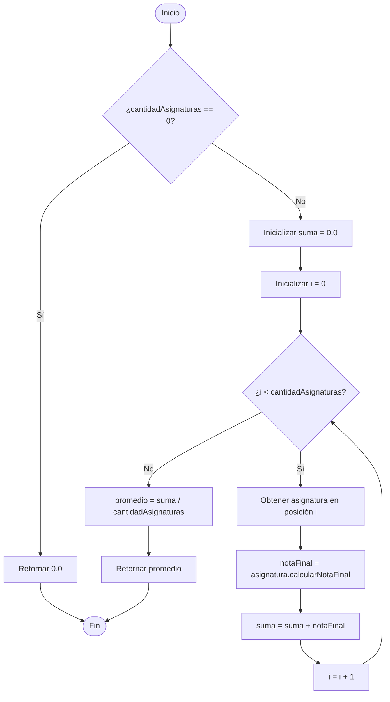
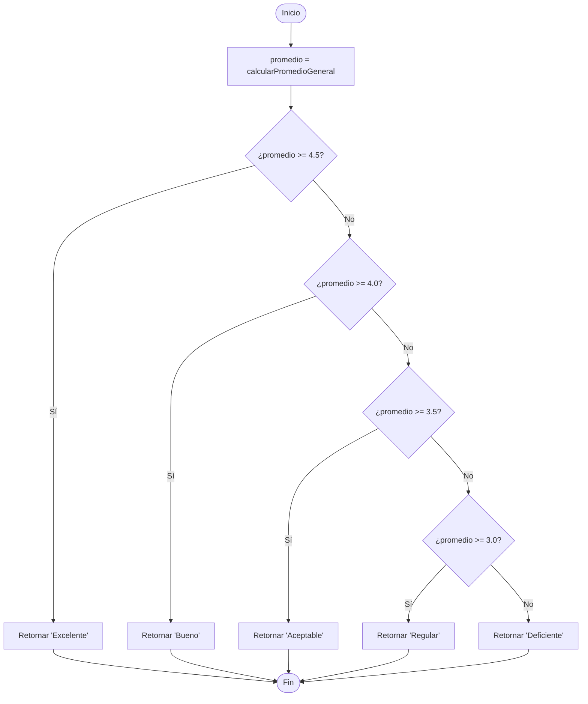
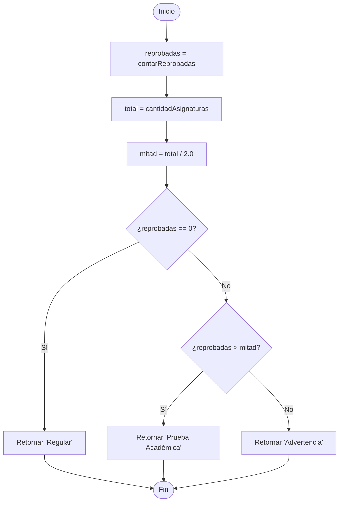
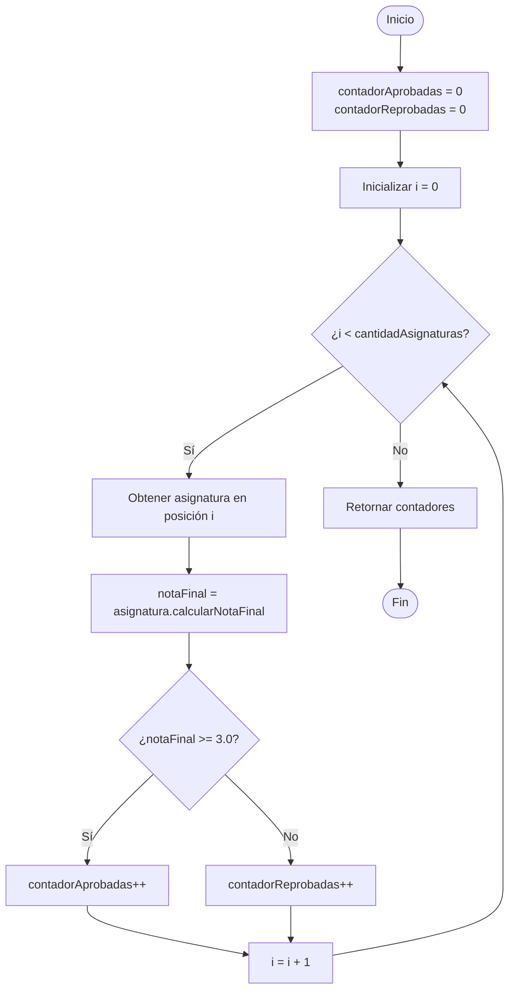
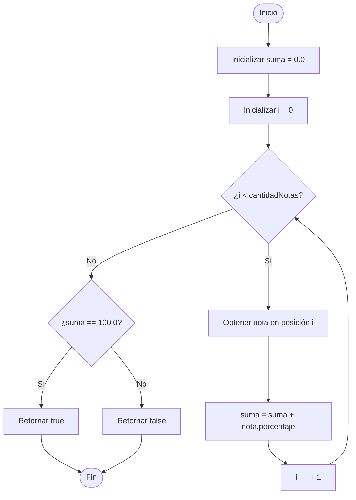

# 🎓 Guía Explicativa Didáctica: Sistema de Gestión Académica

## 📖 Introducción: ¿Por qué estamos aquí?

Antes de sumergirnos en código, clases y métodos, hagamos una pausa. Imagina que eres un estudiante universitario. Cada semestre cursas varias materias. En cada materia tienes exámenes, talleres, proyectos. Al final del semestre, te preguntas: **¿Cómo me fue? ¿Cuánto es mi promedio? ¿Aprobé todas mis materias?**

Este ejercicio no es sobre programación por programación. Es sobre **modelar la realidad** usando código. Vamos a transformar algo que todos conocemos (el sistema académico) en clases, atributos y métodos.

---

## 🤔 Paso 1: Entendiendo el Mundo Real (Antes del Código)

### La Historia Completa

Piensa en María, una estudiante de segundo semestre:

1. **María es una estudiante** con un nombre, un código único y está cursando un semestre específico
2. **María está tomando 4 materias** este semestre: Cálculo, Física, Programación e Inglés
3. **En cada materia tiene varias notas**: En Cálculo tiene 3 notas (2 parciales y un final), en Física tiene 5 notas (2 quices, un laboratorio, un parcial y un final), etc.
4. **Cada nota no vale lo mismo**: El examen final de Cálculo vale 40% pero un quiz de Física solo vale 10%
5. **Al final del semestre, María necesita saber**: ¿Cuál es su promedio? ¿Cuántas materias aprobó? ¿Cuál fue su mejor materia?

### La Pregunta Clave para el Programador

**¿Cómo representamos esta realidad en código?**

La respuesta: **Orientación a Objetos**. Vamos a crear "moldes" (clases) que representen las cosas del mundo real:
- Un molde para "Nota"
- Un molde para "Asignatura"
- Un molde para "Estudiante"

---

## 🧩 Paso 2: Las Tres Piezas del Rompecabezas

### Pieza 1: La Nota (La más pequeña)

Imagina una nota como un **ladrillo individual**. Cada ladrillo tiene:
- Un nombre que lo identifica ("Parcial 1", "Taller 2")
- Un valor (la calificación que sacaste: 4.5, 3.2, etc.)
- Un porcentaje (qué tan importante es en la nota final: 30%, 20%, etc.)

**Analogía del mundo real**: Es como una pieza de LEGO pequeña. Por sí sola no hace mucho, pero es fundamental para construir algo más grande.

### Pieza 2: La Asignatura (Mediana)

Una asignatura es un **conjunto de notas**. Es como una caja que contiene varios ladrillos (notas):
- Tiene un nombre ("Cálculo I", "Programación")
- Contiene múltiples notas (hasta 10)
- Puede calcular su nota final combinando todas sus notas

**Analogía del mundo real**: Es como una caja de LEGO temática. Contiene varias piezas (notas) y juntas forman algo completo (la nota final de la materia).

### Pieza 3: El Estudiante (La más grande)

Un estudiante es un **conjunto de asignaturas**. Es como una estantería que contiene varias cajas (asignaturas):
- Tiene información personal (nombre, código, semestre)
- Contiene múltiples asignaturas (hasta 8)
- Puede calcular su promedio general combinando todas sus asignaturas
- Puede generar reportes académicos completos

**Analogía del mundo real**: Es como tu estantería de LEGO completa. Contiene varias cajas (asignaturas), y al verla completa puedes analizar tu colección entera (tu rendimiento académico).

### La Jerarquía Visual

```
Estudiante (María)
    │
    ├── Asignatura (Cálculo I)
    │       ├── Nota (Parcial 1: 3.2, 30%)
    │       ├── Nota (Parcial 2: 3.5, 30%)
    │       └── Nota (Final: 3.8, 40%)
    │
    ├── Asignatura (Física I)
    │       ├── Nota (Quiz 1: 4.0, 10%)
    │       ├── Nota (Quiz 2: 4.5, 10%)
    │       ├── Nota (Laboratorio: 4.2, 20%)
    │       ├── Nota (Parcial: 4.3, 30%)
    │       └── Nota (Final: 4.4, 30%)
    │
    └── ... más asignaturas
```

---

## 🔍 Paso 3: Los Atributos - ¿Qué información necesita cada clase?

### Clase Nota: Los 3 Atributos Esenciales

#### 1. `String nombre`
**¿Qué es?** El nombre descriptivo de la evaluación.
**¿Por qué pertenece a Nota?** Porque cada evaluación necesita ser identificada. Sin nombre, no sabrías si estás viendo "Parcial 1" o "Taller 2".
**Ejemplo**: "Parcial 1", "Quiz Final", "Proyecto"

#### 2. `double valor`
**¿Qué es?** La calificación obtenida (0.0 a 5.0).
**¿Por qué pertenece a Nota?** Es la esencia de una nota. Sin este valor, ¿qué sentido tiene una nota?
**Ejemplo**: 4.5, 3.2, 2.8

#### 3. `double porcentaje`
**¿Qué es?** Qué tanto vale esta nota en la nota final de la asignatura.
**¿Por qué pertenece a Nota?** Porque cada nota tiene un peso diferente. Un examen final no vale lo mismo que un quiz.
**Ejemplo**: 30.0 (significa 30%), 15.0 (significa 15%)

### Clase Asignatura: Los 3 Atributos Fundamentales

#### 1. `String nombre`
**¿Qué es?** El nombre de la materia.
**¿Por qué pertenece a Asignatura?** Para identificar de qué materia estamos hablando.
**Ejemplo**: "Cálculo I", "Programación", "Física"

#### 2. `Nota[] notas`
**¿Qué es?** Un arreglo que almacena todas las notas de esta asignatura (máximo 10).
**¿Por qué pertenece a Asignatura?** Porque una asignatura **contiene** varias notas. Es su contenido principal.
**Ejemplo**: [Nota1, Nota2, Nota3, ...]

#### 3. `int cantidadNotas`
**¿Qué es?** Un contador que indica cuántas notas se han agregado realmente.
**¿Por qué pertenece a Asignatura?** Porque el arreglo puede tener espacio para 10 notas, pero tal vez solo has agregado 5. Necesitas saber cuántas son válidas.
**Ejemplo**: 5 (significa que hay 5 notas en el arreglo)

### Clase Estudiante: Los 5 Atributos Clave

#### 1. `String nombreCompleto`
**¿Qué es?** El nombre del estudiante.
**¿Por qué pertenece a Estudiante?** Identifica a quién pertenece este registro académico.
**Ejemplo**: "María González"

#### 2. `String codigo`
**¿Qué es?** El código único del estudiante.
**¿Por qué pertenece a Estudiante?** Es su identificación única en el sistema universitario.
**Ejemplo**: "202315001"

#### 3. `int semestre`
**¿Qué es?** El semestre que está cursando.
**¿Por qué pertenece a Estudiante?** Contextualiza en qué punto de su carrera está el estudiante.
**Ejemplo**: 2 (segundo semestre)

#### 4. `Asignatura[] asignaturas`
**¿Qué es?** Un arreglo que almacena todas las asignaturas que está cursando (máximo 8).
**¿Por qué pertenece a Estudiante?** Porque un estudiante **tiene** varias asignaturas. Es la esencia de su vida académica.
**Ejemplo**: [Asignatura1, Asignatura2, ...]

#### 5. `int cantidadAsignaturas`
**¿Qué es?** Un contador de cuántas asignaturas ha agregado realmente.
**¿Por qué pertenece a Estudiante?** Por la misma razón que en Asignatura: el arreglo puede tener espacio para 8, pero tal vez solo hay 4.
**Ejemplo**: 4 (el estudiante está cursando 4 materias)

---

## ⚙️ Paso 4: Los Métodos - ¿Qué puede hacer cada clase?

### El Principio Fundamental: Cada clase hace lo que LE corresponde

**Pregunta clave**: ¿Quién es el responsable de calcular algo?
- ¿La nota final de una asignatura? → La **Asignatura** misma
- ¿El promedio general del estudiante? → El **Estudiante** mismo
- ¿Validar si una nota es válida? → La **Nota** o quien la usa

Este principio se llama **cohesión**: cada clase debe ser responsable solo de sus propios datos y operaciones.

### Métodos de la Clase Nota

#### 1. `Nota(String nombre, double valor, double porcentaje)` - Constructor
**¿Qué hace?** Crea una nueva nota con los valores proporcionados.
**¿Por qué pertenece aquí?** Porque necesitamos una forma de crear objetos Nota.
**Responsabilidad**: Inicializar los atributos.

#### 2. `getNombre()`, `getValor()`, `getPorcentaje()` - Getters
**¿Qué hacen?** Devuelven el valor de cada atributo.
**¿Por qué pertenecen aquí?** Porque necesitamos acceder a los datos privados de la nota.
**Responsabilidad**: Dar acceso controlado a los atributos.

### Métodos de la Clase Asignatura

#### 1. `Asignatura(String nombre)` - Constructor
**¿Qué hace?** Crea una nueva asignatura con un nombre.
**¿Por qué pertenece aquí?** Inicializa la asignatura, crea el arreglo de notas y pone el contador en 0.
**Responsabilidad**: Preparar la asignatura para usarse.

#### 2. `agregarNota(String nombre, double valor, double porcentaje)`
**¿Qué hace?** Agrega una nueva nota a esta asignatura.
**¿Por qué pertenece aquí?** Porque la asignatura es la que **contiene** las notas, debe controlar cómo se agregan.
**Responsabilidad**:
- Validar que no se exceda el límite (10 notas)
- Validar que el valor esté entre 0.0 y 5.0
- Crear el objeto Nota y agregarlo al arreglo
- Incrementar el contador

#### 3. `calcularNotaFinal()`
**¿Qué hace?** Calcula la nota final de la asignatura usando promedio ponderado.
**¿Por qué pertenece aquí?** Porque la asignatura es la que tiene las notas, debe calcular su propia nota final.
**Responsabilidad**:
- Recorrer todas sus notas
- Multiplicar cada valor por su porcentaje/100
- Sumar todo
- Retornar el resultado

**Fórmula**: NotaFinal = Σ(valor × porcentaje/100)

#### 4. `validarPorcentajes()`
**¿Qué hace?** Verifica que la suma de porcentajes sea exactamente 100.
**¿Por qué pertenece aquí?** Porque solo esta asignatura conoce sus propias notas y puede validarlas.
**Responsabilidad**:
- Sumar todos los porcentajes
- Verificar si la suma es 100
- Retornar true o false

#### 5. `determinarEstado()`
**¿Qué hace?** Determina si la asignatura está aprobada, aprobada con excelencia o reprobada.
**¿Por qué pertenece aquí?** Porque el estado depende de la nota final de esta asignatura específica.
**Responsabilidad**:
- Calcular la nota final
- Clasificarla según las reglas (≥4.5: Excelencia, ≥3.0: Aprobada, <3.0: Reprobada)
- Retornar el estado

#### 6. `getNombre()` - Getter
**¿Qué hace?** Devuelve el nombre de la asignatura.
**¿Por qué pertenece aquí?** Para acceder al nombre desde fuera de la clase.

### Métodos de la Clase Estudiante

#### 1. `Estudiante(String nombreCompleto, String codigo, int semestre)` - Constructor
**¿Qué hace?** Crea un nuevo estudiante con su información personal.
**¿Por qué pertenece aquí?** Inicializa al estudiante, crea el arreglo de asignaturas y pone el contador en 0.
**Responsabilidad**: Preparar el estudiante para usarse.

#### 2. `agregarAsignatura(Asignatura asignatura)`
**¿Qué hace?** Agrega una asignatura al estudiante.
**¿Por qué pertenece aquí?** Porque el estudiante es el que **contiene** las asignaturas.
**Responsabilidad**:
- Validar que no se exceda el límite (8 asignaturas)
- Agregar la asignatura al arreglo
- Incrementar el contador

#### 3. `calcularPromedioGeneral()`
**¿Qué hace?** Calcula el promedio general del estudiante (promedio de las notas finales de todas las asignaturas).
**¿Por qué pertenece aquí?** Porque el estudiante es el único que conoce todas sus asignaturas.
**Responsabilidad**:
- Recorrer todas las asignaturas
- Obtener la nota final de cada una
- Sumar todas las notas finales
- Dividir entre la cantidad de asignaturas
- Retornar el promedio

**Fórmula**: Promedio = Σ(notasFinales) / cantidadAsignaturas

#### 4. `clasificarRendimiento()`
**¿Qué hace?** Clasifica el rendimiento del estudiante (Excelente, Bueno, Aceptable, Regular, Deficiente).
**¿Por qué pertenece aquí?** Porque la clasificación depende del promedio general del estudiante.
**Responsabilidad**:
- Calcular el promedio general
- Clasificarlo según las reglas:
  - ≥4.5: Excelente
  - ≥4.0: Bueno
  - ≥3.5: Aceptable
  - ≥3.0: Regular
  - <3.0: Deficiente
- Retornar la clasificación

#### 5. `contarAprobadas()` y `contarReprobadas()`
**¿Qué hacen?** Cuentan cuántas asignaturas aprobó y reprobó.
**¿Por qué pertenecen aquí?** Porque el estudiante es el que tiene todas las asignaturas.
**Responsabilidad**:
- Recorrer todas las asignaturas
- Calcular la nota final de cada una
- Contar cuántas son ≥3.0 (aprobadas) y <3.0 (reprobadas)
- Retornar los conteos

#### 6. `determinarEstadoAcademico()`
**¿Qué hace?** Determina si el estudiante está Regular, en Advertencia o en Prueba Académica.
**¿Por qué pertenece aquí?** Porque depende de cuántas materias reprobó el estudiante.
**Responsabilidad**:
- Contar materias reprobadas
- Comparar con la mitad del total
- Determinar el estado:
  - 0 reprobadas: Regular
  - Más de la mitad: Prueba Académica
  - Entre 1 y la mitad: Advertencia
- Retornar el estado

#### 7. `encontrarMejorAsignatura()` y `encontrarPeorAsignatura()`
**¿Qué hacen?** Encuentran la asignatura con la nota final más alta y más baja.
**¿Por qué pertenecen aquí?** Porque el estudiante tiene acceso a todas sus asignaturas.
**Responsabilidad**:
- Recorrer todas las asignaturas
- Calcular la nota final de cada una
- Encontrar la máxima o mínima
- Retornar el nombre de la asignatura y su nota

#### 8. `encontrarMejorNotaIndividual()` y `encontrarPeorNotaIndividual()`
**¿Qué hacen?** Encuentran la nota individual más alta y más baja de todas las evaluaciones.
**¿Por qué pertenecen aquí?** Porque el estudiante debe analizar todas las notas de todas sus asignaturas.
**Responsabilidad**:
- Recorrer todas las asignaturas
- Para cada asignatura, recorrer todas sus notas
- Encontrar el valor máximo o mínimo
- Retornar ese valor

#### 9. `mostrarReporteCompleto()`
**¿Qué hace?** Genera un reporte completo con toda la información académica del estudiante.
**¿Por qué pertenece aquí?** Porque el estudiante es el protagonista del reporte, tiene acceso a toda su información.
**Responsabilidad**:
- Imprimir información personal
- Listar todas las asignaturas con sus notas finales
- Mostrar promedio general y clasificación
- Mostrar conteo de aprobadas y reprobadas
- Mostrar estado académico
- Mostrar mejor y peor asignatura
- Mostrar mejor y peor nota individual

---

## 📊 Paso 5: Diagrama de Clases

Ahora que entendemos los atributos y métodos, veamos cómo se relacionan visualmente:



### Explicación de las Relaciones

**Estudiante contiene Asignaturas (Composición)**
- Un estudiante **tiene** asignaturas
- Las asignaturas no pueden existir sin un estudiante en este contexto
- La notación `*--` indica composición (el todo posee las partes)
- `"1" *-- "0..8"` significa: 1 estudiante puede tener de 0 a 8 asignaturas

**Asignatura contiene Notas (Composición)**
- Una asignatura **tiene** notas
- Las notas no pueden existir sin una asignatura en este contexto
- `"1" *-- "0..10"` significa: 1 asignatura puede tener de 0 a 10 notas

**Notación de Visibilidad**:
- `-` (menos): atributo privado, solo accesible dentro de la clase
- `+` (más): método público, accesible desde fuera de la clase

---

## 🔒 Paso 6: Encapsulamiento - El Corazón de la Orientación a Objetos

### ¿Qué es el Encapsulamiento?

Imagina que compras un auto. Cuando quieres avanzar, simplemente pisas el acelerador. **No necesitas saber** cómo funciona el motor internamente, cómo se inyecta el combustible, o cómo se transmite la potencia a las ruedas. Todo eso está **oculto** dentro del auto. Solo interactúas con la interfaz simple: pedales y volante.

**Encapsulamiento en programación es exactamente eso**:
- **Ocultar** los detalles internos de cómo funciona algo (los atributos)
- **Exponer** solo una interfaz pública simple para usarlo (los métodos)

### Los Tres Pilares del Encapsulamiento

#### 1. **Atributos Privados** (Ocultar datos)
```java
private String nombre;
private double valor;
private double porcentaje;
```
**¿Por qué?** Para que nadie pueda cambiar los datos directamente de manera incorrecta.

**Sin encapsulamiento** (mal):
```java
Nota nota = new Nota();
nota.valor = 7.5;  // ¡Error! Las notas van de 0 a 5, nadie lo validó
```

**Con encapsulamiento** (bien):
```java
Nota nota = new Nota("Parcial", 7.5, 30);
// El constructor valida y rechaza este valor
```

#### 2. **Métodos Públicos** (Interfaz controlada)
```java
public double getValor() {
    return valor;
}

public void agregarNota(String nombre, double valor, double porcentaje) {
    if (valor < 0.0 || valor > 5.0) {
        System.out.println("Error: nota inválida");
        return;
    }
    // Agregar la nota...
}
```
**¿Por qué?** Para controlar cómo se accede y modifica la información.

#### 3. **Validaciones Internas** (Proteger la integridad)
```java
public void agregarNota(...) {
    // Validación 1: ¿El valor es válido?
    if (valor < 0.0 || valor > 5.0) return;

    // Validación 2: ¿Hay espacio en el arreglo?
    if (cantidadNotas >= 10) return;

    // Validación 3: ¿El porcentaje es positivo?
    if (porcentaje <= 0) return;

    // Todo bien, ahora sí agregar
    notas[cantidadNotas] = new Nota(nombre, valor, porcentaje);
    cantidadNotas++;
}
```

### Aplicando Encapsulamiento a Nuestro Ejercicio

#### En la Clase Nota
**Encapsulado**:
```java
private String nombre;
private double valor;
private double porcentaje;

public double getValor() {
    return valor;  // Acceso controlado
}
```

**Beneficio**: Nadie puede poner un valor inválido directamente. Solo se puede crear una Nota a través del constructor, que valida los datos.

#### En la Clase Asignatura
**Encapsulado**:
```java
private Nota[] notas;
private int cantidadNotas;

public void agregarNota(String nombre, double valor, double porcentaje) {
    // Validaciones...
    // Solo aquí se puede modificar el arreglo de notas
}
```

**Beneficio**:
- Nadie puede agregar más de 10 notas (está validado internamente)
- Nadie puede manipular directamente el arreglo y romper la lógica
- El contador siempre está sincronizado con el arreglo

#### En la Clase Estudiante
**Encapsulado**:
```java
private Asignatura[] asignaturas;
private int cantidadAsignaturas;

public void agregarAsignatura(Asignatura asignatura) {
    // Validaciones...
    // Solo aquí se puede modificar el arreglo de asignaturas
}
```

**Beneficio**:
- Nadie puede agregar más de 8 asignaturas
- El estudiante controla su propia información académica
- Los cálculos complejos (promedio, estado) están encapsulados en métodos simples

### El Antes y Después del Encapsulamiento

**Sin Encapsulamiento** (todo público):
```java
// Cualquiera puede hacer esto:
estudiante.codigo = "";  // ¡Código vacío!
estudiante.cantidadAsignaturas = 100;  // ¡Más de 8!
estudiante.asignaturas[0] = null;  // ¡Asignatura nula!
// Sistema roto 💥
```

**Con Encapsulamiento** (atributos privados):
```java
// Solo puedes hacer esto:
Estudiante estudiante = new Estudiante("María", "2023001", 2);
estudiante.agregarAsignatura(asignatura);  // Validado internamente
double promedio = estudiante.calcularPromedioGeneral();  // Método seguro
// Sistema protegido ✅
```

### Ventajas del Encapsulamiento en Este Ejercicio

1. **Protección de Datos**: No se pueden poner valores inválidos (notas > 5.0, más de 10 notas, etc.)
2. **Mantenibilidad**: Si cambia la forma de calcular el promedio, solo cambias el método, no todo el código
3. **Claridad**: Los métodos tienen nombres claros (`calcularPromedioGeneral()`) en vez de código repetido
4. **Reutilización**: El método `calcularNotaFinal()` se puede usar en múltiples lugares sin duplicar código
5. **Consistencia**: Los contadores siempre están actualizados porque solo se modifican dentro de métodos controlados

---

## 📈 Paso 7: Diagramas de Flujo de los Métodos Principales

### Método 1: `calcularNotaFinal()` en Asignatura

Este método calcula la nota final de una asignatura usando promedio ponderado.



**Explicación paso a paso**:
1. Comenzamos con `notaFinal = 0.0`
2. Validamos que haya al menos una nota
3. Recorremos todas las notas con un ciclo `for` (representado por el índice `i`)
4. Para cada nota, calculamos su contribución: `valor × (porcentaje/100)`
5. Sumamos la contribución a `notaFinal`
6. Al final, retornamos `notaFinal`

**Ejemplo con números reales**:
- Parcial 1: 4.0 (30%) → contribución = 4.0 × 0.30 = 1.2
- Taller: 3.5 (20%) → contribución = 3.5 × 0.20 = 0.7
- Final: 4.5 (50%) → contribución = 4.5 × 0.50 = 2.25
- **Nota Final = 1.2 + 0.7 + 2.25 = 4.15**

---

### Método 2: `determinarEstado()` en Asignatura

Este método determina si la asignatura está aprobada, aprobada con excelencia o reprobada.



**Explicación paso a paso**:
1. Primero calculamos la nota final llamando a `calcularNotaFinal()`
2. Verificamos si es ≥ 4.5 → Si sí: "Aprobada con Excelencia"
3. Si no, verificamos si es ≥ 3.0 → Si sí: "Aprobada"
4. Si tampoco: "Reprobada"

**Ejemplos**:
- Nota final 4.7 → "Aprobada con Excelencia" ✅
- Nota final 3.5 → "Aprobada" ✅
- Nota final 2.8 → "Reprobada" ❌

---

### Método 3: `calcularPromedioGeneral()` en Estudiante

Este método calcula el promedio general del estudiante (promedio de todas las notas finales).



**Explicación paso a paso**:
1. Validamos que haya al menos una asignatura
2. Inicializamos `suma = 0.0`
3. Recorremos todas las asignaturas con un ciclo
4. Para cada asignatura, calculamos su nota final y la sumamos
5. Al final, dividimos la suma entre la cantidad de asignaturas
6. Retornamos el promedio

**Ejemplo con números reales**:
- Asignatura 1: Nota final = 3.53
- Asignatura 2: Nota final = 4.30
- Asignatura 3: Nota final = 2.91
- Asignatura 4: Nota final = 4.65
- **Suma = 3.53 + 4.30 + 2.91 + 4.65 = 15.39**
- **Promedio = 15.39 / 4 = 3.85**

---

### Método 4: `clasificarRendimiento()` en Estudiante

Este método clasifica el rendimiento del estudiante según su promedio.



**Explicación paso a paso**:
1. Calculamos el promedio general
2. Verificamos en orden descendente:
   - ≥4.5 → "Excelente"
   - ≥4.0 → "Bueno"
   - ≥3.5 → "Aceptable"
   - ≥3.0 → "Regular"
   - <3.0 → "Deficiente"

**Ejemplos**:
- Promedio 4.8 → "Excelente" 🌟
- Promedio 4.2 → "Bueno" 😊
- Promedio 3.7 → "Aceptable" 👍
- Promedio 3.2 → "Regular" 😐
- Promedio 2.5 → "Deficiente" 😰

---

### Método 5: `determinarEstadoAcademico()` en Estudiante

Este método determina si el estudiante está Regular, en Advertencia o en Prueba Académica.



**Explicación paso a paso**:
1. Contamos cuántas materias reprobó el estudiante
2. Obtenemos el total de asignaturas
3. Calculamos la mitad del total
4. Evaluamos:
   - Si reprobó 0: "Regular" (todo bien)
   - Si reprobó más de la mitad: "Prueba Académica" (crisis)
   - Si no: "Advertencia" (alerta)

**Ejemplos**:
- Total: 4, Reprobadas: 0 → "Regular" ✅
- Total: 4, Reprobadas: 1 → "Advertencia" ⚠️
- Total: 4, Reprobadas: 2 → "Advertencia" ⚠️ (2 no es > 2.0)
- Total: 4, Reprobadas: 3 → "Prueba Académica" 🚨 (3 > 2.0)
- Total: 5, Reprobadas: 3 → "Prueba Académica" 🚨 (3 > 2.5)

---

### Método 6: `contarAprobadas()` y `contarReprobadas()` en Estudiante

Estos métodos cuentan cuántas asignaturas aprobó y reprobó el estudiante.



**Explicación paso a paso**:
1. Inicializamos dos contadores en 0
2. Recorremos todas las asignaturas
3. Para cada asignatura, calculamos su nota final
4. Si la nota final es ≥ 3.0, incrementamos `contadorAprobadas`
5. Si no, incrementamos `contadorReprobadas`
6. Al final, retornamos ambos contadores

**Ejemplo**:
- Asignatura 1: 3.53 → ≥3.0 → Aprobada ✅
- Asignatura 2: 4.30 → ≥3.0 → Aprobada ✅
- Asignatura 3: 2.91 → <3.0 → Reprobada ❌
- Asignatura 4: 4.65 → ≥3.0 → Aprobada ✅
- **Resultado: 3 aprobadas, 1 reprobada**

---

### Método 7: `encontrarMejorAsignatura()` en Estudiante

Este método encuentra la asignatura con la nota final más alta.

```mermaid
flowchart TD
    A([Inicio]) --> B{¿cantidadAsignaturas == 0?}
    B -->|Sí| C[Retornar 'Sin asignaturas']
    B -->|No| D[mejorAsignatura = asignaturas\[0\]<br>mejorNota = mejorAsignatura.calcularNotaFinal]
    D --> E[Inicializar i = 1]
    E --> F{¿i < cantidadAsignaturas?}
    F -->|No| G[Retornar nombre y nota de mejorAsignatura]
    F -->|Sí| H[Obtener asignatura en posición i]
    H --> I[notaActual = asignatura.calcularNotaFinal]
    I --> J{¿notaActual > mejorNota?}
    J -->|Sí| K[mejorAsignatura = asignatura<br>mejorNota = notaActual]
    J -->|No| L[No hacer nada]
    K --> M[i = i + 1]
    L --> M
    M --> F
    C --> N([Fin])
    G --> N
```

**Explicación paso a paso**:
1. Validamos que haya al menos una asignatura
2. Asumimos que la primera asignatura es la mejor (inicialización)
3. Recorremos las demás asignaturas empezando en i = 1
4. Para cada asignatura, calculamos su nota final
5. Si esta nota es mayor que la mejor encontrada hasta ahora, la actualizamos
6. Al final, retornamos el nombre y nota de la mejor asignatura

**Ejemplo**:
- Asignatura 1 (Cálculo): 3.53 → Mejor actual
- Asignatura 2 (Física): 4.30 → 4.30 > 3.53 → Nueva mejor
- Asignatura 3 (Programación): 2.91 → 2.91 < 4.30 → No cambia
- Asignatura 4 (Inglés): 4.65 → 4.65 > 4.30 → Nueva mejor
- **Resultado: Inglés con 4.65**

---

### Método 8: `validarPorcentajes()` en Asignatura

Este método valida que la suma de porcentajes sea exactamente 100.



**Explicación paso a paso**:
1. Inicializamos `suma = 0.0`
2. Recorremos todas las notas
3. Para cada nota, sumamos su porcentaje
4. Al final, verificamos si la suma es exactamente 100.0
5. Retornamos true si es 100, false si no lo es

**Ejemplos**:
- Notas: 30%, 20%, 50% → Suma = 100% → true ✅
- Notas: 30%, 20%, 40% → Suma = 90% → false ❌
- Notas: 30%, 25%, 50% → Suma = 105% → false ❌

---

## 🎯 Paso 8: Ejemplo Completo - De la Teoría a la Práctica

Ahora que entendemos todo, veamos cómo se usa en la práctica:

### Creando a María González (del Ejemplo 2)

```java
// 1. Crear el estudiante
Estudiante maria = new Estudiante("María González", "202315001", 2);

// 2. Crear la asignatura Cálculo I
Asignatura calculo = new Asignatura("Cálculo I");
calculo.agregarNota("Parcial 1", 3.2, 30);
calculo.agregarNota("Parcial 2", 3.5, 30);
calculo.agregarNota("Examen Final", 3.8, 40);

// 3. Crear la asignatura Física I
Asignatura fisica = new Asignatura("Física I");
fisica.agregarNota("Quiz 1", 4.0, 10);
fisica.agregarNota("Quiz 2", 4.5, 10);
fisica.agregarNota("Laboratorio", 4.2, 20);
fisica.agregarNota("Parcial", 4.3, 30);
fisica.agregarNota("Examen Final", 4.4, 30);

// 4. Crear la asignatura Programación I
Asignatura programacion = new Asignatura("Programación I");
programacion.agregarNota("Talleres", 2.8, 20);
programacion.agregarNota("Parcial", 2.5, 30);
programacion.agregarNota("Proyecto", 3.2, 50);

// 5. Crear la asignatura Inglés I
Asignatura ingles = new Asignatura("Inglés I");
ingles.agregarNota("Oral", 4.5, 25);
ingles.agregarNota("Escrito", 4.8, 25);
ingles.agregarNota("Parcial", 4.6, 30);
ingles.agregarNota("Final", 4.7, 20);

// 6. Agregar todas las asignaturas a María
maria.agregarAsignatura(calculo);
maria.agregarAsignatura(fisica);
maria.agregarAsignatura(programacion);
maria.agregarAsignatura(ingles);

// 7. Mostrar el reporte completo
maria.mostrarReporteCompleto();
```

### Salida Esperada:

```
========================================
    REPORTE ACADÉMICO DEL ESTUDIANTE
========================================
Nombre: María González
Código: 202315001
Semestre: 2
----------------------------------------
ASIGNATURAS CURSADAS:
----------------------------------------
1. Cálculo I: 3.53 (APROBADA)
2. Física I: 4.30 (APROBADA)
3. Programación I: 2.91 (REPROBADA)
4. Inglés I: 4.65 (APROBADA CON EXCELENCIA)
----------------------------------------
RESUMEN ACADÉMICO:
----------------------------------------
Promedio General: 3.85
Clasificación: Aceptable
Asignaturas Aprobadas: 3
Asignaturas Reprobadas: 1
Estado Académico: Advertencia
----------------------------------------
ANÁLISIS DE FORTALEZAS Y DEBILIDADES:
----------------------------------------
Mejor Asignatura: Inglés I (4.65)
Peor Asignatura: Programación I (2.91)
Mejor Nota Individual: 4.8
Peor Nota Individual: 2.5
========================================
```

---

## 💡 Paso 9: Conceptos Clave para Recordar

### 1. La Diferencia entre Promedio Ponderado y Promedio Aritmético

**Promedio Ponderado** (para nota final de una asignatura):
- Cada nota tiene un peso diferente
- Fórmula: Σ(valor × peso/100)
- Ejemplo: Parcial 4.0 (30%) + Final 5.0 (70%) = (4.0 × 0.3) + (5.0 × 0.7) = 1.2 + 3.5 = 4.7

**Promedio Aritmético** (para promedio general):
- Todas las asignaturas valen igual
- Fórmula: Σ(valores) / cantidad
- Ejemplo: (4.0 + 3.5 + 4.5) / 3 = 12.0 / 3 = 4.0

### 2. La Importancia de los Contadores

En los arreglos, **siempre necesitas un contador**:
```java
private Nota[] notas = new Nota[10];  // Capacidad: 10
private int cantidadNotas = 0;         // Cuántas hay realmente
```

¿Por qué? Porque el arreglo puede tener espacio para 10, pero tal vez solo has agregado 3. El contador te dice cuántas posiciones están ocupadas.

### 3. La Composición: "Tiene un" (Has-A)

- Un Estudiante **tiene** Asignaturas
- Una Asignatura **tiene** Notas

Esto se refleja en los atributos:
```java
private Asignatura[] asignaturas;  // El estudiante "tiene" asignaturas
```

### 4. La Responsabilidad Única

Cada clase tiene una responsabilidad:
- **Nota**: Almacenar información de una evaluación
- **Asignatura**: Gestionar sus notas y calcular su nota final
- **Estudiante**: Gestionar sus asignaturas y calcular su rendimiento general

### 5. Validaciones Siempre

**Nunca confíes en los datos de entrada**. Siempre valida:
- ¿La nota está entre 0.0 y 5.0?
- ¿Los porcentajes suman 100?
- ¿No se excede el límite del arreglo?
- ¿El dato no es nulo o vacío?

---

## 🚀 Paso 10: Próximos Pasos

Ahora que entiendes el ejercicio completamente, es hora de implementarlo:

### Checklist de Implementación

**Fase 1: Clase Nota** ✅
- [ ] Crear atributos privados (nombre, valor, porcentaje)
- [ ] Crear constructor con validaciones
- [ ] Crear getters

**Fase 2: Clase Asignatura** ✅
- [ ] Crear atributos privados (nombre, notas[], cantidadNotas)
- [ ] Crear constructor que inicialice el arreglo
- [ ] Implementar `agregarNota()` con validaciones
- [ ] Implementar `calcularNotaFinal()`
- [ ] Implementar `validarPorcentajes()`
- [ ] Implementar `determinarEstado()`

**Fase 3: Clase Estudiante** ✅
- [ ] Crear atributos privados (nombreCompleto, codigo, semestre, asignaturas[], cantidadAsignaturas)
- [ ] Crear constructor que inicialice el arreglo
- [ ] Implementar `agregarAsignatura()` con validaciones
- [ ] Implementar `calcularPromedioGeneral()`
- [ ] Implementar `clasificarRendimiento()`
- [ ] Implementar `contarAprobadas()` y `contarReprobadas()`
- [ ] Implementar `determinarEstadoAcademico()`
- [ ] Implementar `encontrarMejorAsignatura()` y `encontrarPeorAsignatura()`
- [ ] Implementar `encontrarMejorNotaIndividual()` y `encontrarPeorNotaIndividual()`
- [ ] Implementar `mostrarReporteCompleto()`

**Fase 4: Programa Principal** ✅
- [ ] Crear clase `SistemaAcademico` con método `main`
- [ ] Crear caso de prueba (María González)
- [ ] Verificar que los resultados coincidan con el ejemplo

### Consejos para Implementar

1. **Implementa paso a paso**: No intentes hacer todo de una vez. Empieza por la clase Nota, pruébala, luego pasa a Asignatura, etc.

2. **Prueba cada método individualmente**: Antes de pasar al siguiente, asegúrate de que el método actual funciona.

3. **Usa System.out.println() para depurar**: Si algo no funciona, imprime los valores para ver qué está pasando.

4. **Compara con los ejemplos**: Usa los ejemplos del enunciado (María, Carlos, etc.) para verificar que tus cálculos son correctos.

5. **No olvides las validaciones**: Un sistema robusto siempre valida los datos de entrada.

---

## 🎉 Conclusión

Has completado el viaje de entendimiento de este ejercicio. Ahora sabes:
- **Qué** representa cada clase (Nota, Asignatura, Estudiante)
- **Por qué** cada atributo y método pertenece a su clase
- **Cómo** se relacionan las clases entre sí
- **Para qué** sirve el encapsulamiento
- **Cómo** funcionan los métodos principales mediante diagramas de flujo

La orientación a objetos no es solo sintaxis de Java. Es una **forma de pensar**, una manera de modelar el mundo real en código. Este ejercicio te enseña a:
- Identificar entidades del mundo real (estudiante, asignatura, nota)
- Modelarlas como clases
- Definir sus atributos (características)
- Definir sus métodos (comportamientos)
- Relacionarlas correctamente (composición)
- Protegerlas con encapsulamiento

**Recuerda**: La programación es como construir con LEGO. Empiezas con piezas pequeñas (Nota), las combinas en estructuras medianas (Asignatura), y finalmente construyes algo complejo (Estudiante con todo su sistema académico).

¡Ahora es tu turno de implementar! 💪🚀
