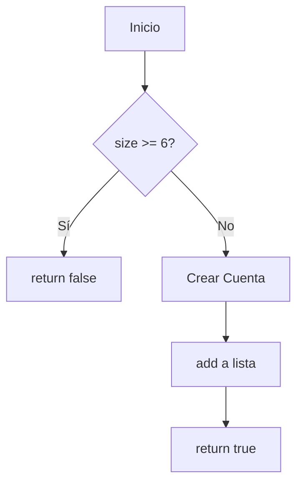

# 📚 Prompt para Sitio Web Didáctico - Fundamentos de POO

## 🎯 Objetivo

Crear un **sitio web didáctico** que enseñe 4 conceptos de POO en Java usando el ejercicio de Cuentas Bancarias.

**Proyecto:** `ejerciciomultiplesclasescuentas/template_cuenta_bancaria`
**Sitio:** `ejerciciomultiplesclasescuentas/site/`

---

## 📋 Temas (4 páginas)

1. **Constructor** - Clase Cuenta
2. **Encapsulamiento** - Getters y Setters
3. **ArrayList** - Crear e inicializar
4. **ArrayList** - Agregar con add()

---

## 📖 Contenido por Página

### **PÁGINA 1: Constructor**

**Qué debe aprender:**
- Qué es un constructor
- Sintaxis básica
- Uso de `this`
- Implementar constructor de `Cuenta`

**Estructura:**

**1. Teoría Básica (25%)**
```
¿Qué es un constructor?
- Se ejecuta al crear un objeto
- Inicializa atributos
- Mismo nombre que la clase
```

**2. El problema (15%)**
```
Clase Cuenta tiene:
- numeroCuenta (String)
- tipo (String)
- saldo (double)
- transaccionesMes (int)

¿Cuáles son parámetros del constructor?
→ Solo tipo y numeroCuenta
¿Por qué?
→ Saldo inicia en 0
→ Transacciones inician en 0
```

**3. Explicar `this` (20%)**
```java
public Cuenta(String tipo, String numeroCuenta) {
    this.tipo = tipo;  // ← this.tipo es el atributo
                       //    tipo es el parámetro
}
```

**Visual:**
```
Parámetro: tipo (local)
           ↓
    this.tipo = tipo
    ↑
Atributo de la clase
```

**4. Implementación (40%)**

**Paso 1:** Firma del constructor
```java
public Cuenta(String tipo, String numeroCuenta) {
```

**Paso 2:** Asignar parámetros
```java
    this.tipo = tipo;
    this.numeroCuenta = numeroCuenta;
```

**Paso 3:** Inicializar otros atributos
```java
    this.saldo = 0.0;
    this.transaccionesMes = 0;
}
```

**Código completo:**
```java
public Cuenta(String tipo, String numeroCuenta) {
    this.tipo = tipo;
    this.numeroCuenta = numeroCuenta;
    this.saldo = 0.0;
    this.transaccionesMes = 0;
}
```

**Ejemplo de uso:**
```java
Cuenta c = new Cuenta("AHORROS", "001");
// tipo = "AHORROS"
// numeroCuenta = "001"
// saldo = 0.0
// transaccionesMes = 0
```

**Ejercicio:**
- Ubicación: `src/.../logica/Cuenta.java`
- Implementar el constructor

**Errores comunes:**
- Olvidar `this`
- Invertir parámetros
- No inicializar saldo/transacciones

---

### **PÁGINA 2: Encapsulamiento**

**Qué debe aprender:**
- Qué es encapsulamiento
- `private` vs `public`
- Cuándo usar getter/setter
- Implementar getters y setters

**Estructura:**

**1. Teoría (20%)**
```
Encapsulamiento = Proteger datos

private → Solo la clase puede acceder
public → Todos pueden acceder

Getter → Leer un atributo
Setter → Modificar un atributo
```

**2. Reglas para Cuenta (30%)**

| Atributo | Getter | Setter | ¿Por qué? |
|----------|--------|--------|-----------|
| numeroCuenta | ✅ | ❌ | No debe cambiar |
| tipo | ✅ | ✅ | Puede cambiar |
| saldo | ✅ | ❌ | Solo con consignar/retirar |
| transaccionesMes | ✅ | ❌ | Solo internamente |

**¿Por qué saldo NO tiene setter?**
```
❌ cuenta.setSaldo(1000000);  // ¡Peligroso!

✅ cuenta.consignar(1000000);  // Controlado
```

**3. Sintaxis (15%)**

**Getter:**
```java
public TipoRetorno getNombre() {
    return nombre;
}
```

**Setter:**
```java
public void setNombre(TipoParametro nombre) {
    this.nombre = nombre;
}
```

**4. Implementación (35%)**

**Atributos privados (ya están):**
```java
private String numeroCuenta;
private String tipo;
private double saldo;
private int transaccionesMes;
```

**Getters (todos):**
```java
public String getNumeroCuenta() {
    return numeroCuenta;
}

public String getTipo() {
    return tipo;
}

public double getSaldo() {
    return saldo;
}

public int getTransaccionesMes() {
    return transaccionesMes;
}
```

**Setter (solo tipo):**
```java
public void setTipo(String tipo) {
    this.tipo = tipo;
}
```

**Uso:**
```java
Cuenta c = new Cuenta("AHORROS", "001");
System.out.println(c.getNumeroCuenta());  // "001"
System.out.println(c.getSaldo());         // 0.0
c.setTipo("CORRIENTE");                   // OK
```

**Ejercicio:**
- Implementar todos los getters
- Implementar setter de tipo
- NO implementar setters de saldo, numeroCuenta, transaccionesMes

---

### **PÁGINA 3: ArrayList - Crear**

**Qué debe aprender:**
- Qué es ArrayList
- Cómo crear uno
- Inicializar en constructor
- Import necesario

**Estructura:**

**1. ¿Por qué ArrayList? (20%)**

**Antes:**
```java
private Cuenta cuenta1;
private Cuenta cuenta2;
private Cuenta cuenta3;
private Cuenta cuenta4;
private Cuenta cuenta5;
private Cuenta cuenta6;
```
❌ Repetitivo, difícil

**Ahora:**
```java
private ArrayList<Cuenta> cuentas;
```
✅ Simple, flexible

**2. Sintaxis (25%)**

**General:**
```java
ArrayList<Tipo> nombre = new ArrayList<>();
```

**Ejemplos:**
```java
ArrayList<String> nombres = new ArrayList<>();
ArrayList<Integer> edades = new ArrayList<>();
ArrayList<Cuenta> cuentas = new ArrayList<>();
```

**Import:**
```java
import java.util.ArrayList;
```

**3. Aplicar en Cliente (55%)**

**Paso 1:** Import
```java
import java.util.ArrayList;
```

**Paso 2:** Declarar atributo
```java
private ArrayList<Cuenta> cuentas;
```

**Paso 3:** Inicializar en constructor
```java
public Cliente(String nombre, String cedula) {
    this.nombre = nombre;
    this.cedula = cedula;
    this.cuentas = new ArrayList<>();  // ¡Importante!
}
```

**⚠️ Si no inicializas:**
```java
cuentas.add(...);  // ERROR: NullPointerException
```

**Paso 4:** Getter
```java
public ArrayList<Cuenta> getCuentas() {
    return cuentas;
}
```

**Ejercicio:**
- Ubicación: `src/.../logica/Cliente.java`
- Declarar ArrayList de cuentas
- Inicializar en constructor
- Crear getter

---

### **PÁGINA 4: ArrayList - Agregar**

**Qué debe aprender:**
- Método `add()`
- Método `size()`
- Implementar `abrirCuenta()`
- Validar límite

**Estructura:**

**1. Método add() (20%)**

**Sintaxis:**
```java
lista.add(elemento);
```

**Ejemplo:**
```java
ArrayList<String> nombres = new ArrayList<>();
nombres.add("Ana");    // [Ana]
nombres.add("Luis");   // [Ana, Luis]
```

**2. Método size() (15%)**

**Sintaxis:**
```java
int cantidad = lista.size();
```

**Ejemplo:**
```java
System.out.println(nombres.size());  // 2
```

**3. Implementar abrirCuenta() (65%)**

**Firma del método:**
```java
public boolean abrirCuenta(String numeroCuenta, String tipo) {
```

**Paso 1:** Validar límite
```java
if (cuentas.size() >= 6) {
    return false;  // Ya tiene 6 cuentas
}
```

**Paso 2:** Crear cuenta
```java
Cuenta nueva = new Cuenta(tipo, numeroCuenta);
```

**Paso 3:** Agregar a lista
```java
cuentas.add(nueva);
```

**Paso 4:** Retornar éxito
```java
return true;
```

**Código completo:**
```java
public boolean abrirCuenta(String numeroCuenta, String tipo) {
    // Validar límite de 6 cuentas
    if (cuentas.size() >= 6) {
        return false;
    }

    // Crear nueva cuenta
    Cuenta nueva = new Cuenta(tipo, numeroCuenta);

    // Agregar
    cuentas.add(nueva);

    // Éxito
    return true;
}
```

**Diagrama de flujo:**


**Ejemplo de uso:**
```java
Cliente c = new Cliente("Juan", "123");

c.abrirCuenta("001", "AHORROS");
// size = 1

c.abrirCuenta("002", "CORRIENTE");
// size = 2

// ... abrir 4 más ...

c.abrirCuenta("007", "AHORROS");
// return false (ya tiene 6)
```

**Ejercicio:**
- Implementar `abrirCuenta()`
- Probar abriendo 6 cuentas
- Intentar abrir la 7ma

---

## 🎨 Formato del Sitio

### Estructura HTML
```html
<header>
  <h1>Tema X: [Nombre]</h1>
  <progress value="X" max="4"></progress>
</header>

<main>
  <section class="objetivos">💡 Objetivos</section>
  <section class="teoria">📚 Teoría</section>
  <section class="practica">💻 Práctica</section>
  <section class="ejercicio">✏️ Ejercicio</section>
</main>

<nav>
  <button>← Anterior</button>
  <button>Siguiente →</button>
</nav>
```

### Estilos
- Código: Fondo gris claro, fuente monoespaciada
- Títulos: Azul (#2980b9)
- Ejemplos: Borde izquierdo verde
- Advertencias: Fondo amarillo claro

### Elementos
- Sintaxis highlighting con Prism.js
- Diagramas con Mermaid.js
- Botón copiar en bloques de código
- Checkboxes para ejercicios

---

## ✅ Criterios de Calidad

Cada página debe:

**Claridad:**
- [ ] Lenguaje simple
- [ ] Ejemplos antes de teoría
- [ ] Progresión simple → complejo

**Práctica:**
- [ ] Código ejecutable
- [ ] Ejercicio para implementar
- [ ] Verificación clara

**Visual:**
- [ ] Diagramas cuando sea útil
- [ ] Sintaxis destacada
- [ ] No muros de texto

---

## 📂 Estructura de Archivos

```
site/
├── index.html
├── css/
│   └── styles.css
├── js/
│   └── main.js
├── pages/
│   ├── 1-constructor.html
│   ├── 2-encapsulamiento.html
│   ├── 3-arraylist-crear.html
│   └── 4-arraylist-agregar.html
└── assets/
    └── images/
```

---

## 🎯 Resultado Esperado

Un sitio que:
- Sea claro y directo
- Conecte teoría con código real
- Permita practicar inmediatamente
- Valide el aprendizaje

**Duración:** 1-2 horas por página = 4-8 horas total

**Público:** Estudiantes de fundamentos (1er semestre)

---

**¡Listo para generar el sitio! 🚀**
